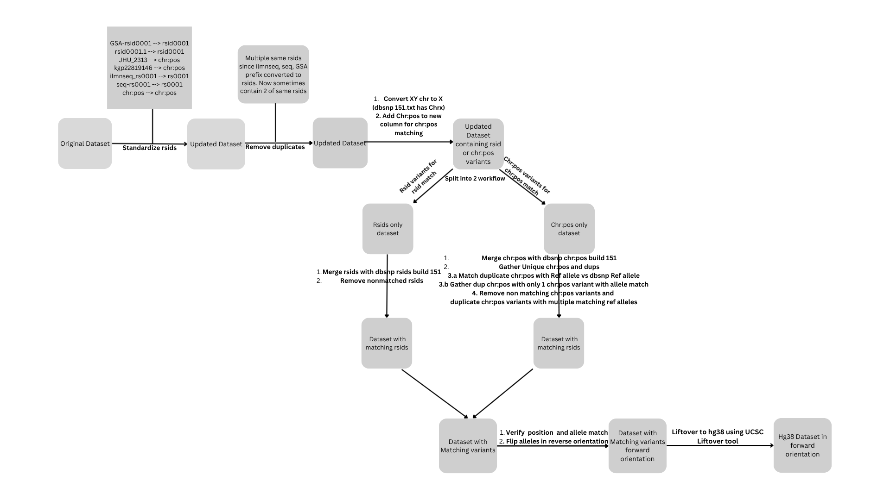

# ***LIFTOVER AND VARIANT PROCESSING PIPELINE***

This repository contains a comprehensive liftover and variant processing pipeline designed to process genotype data, update RSIDs, and perform genomic coordinate conversions from one reference genome to another (e.g., hg19 to hg38). 

The script leverages **PLINK** (v1.9 and v2), UCSC's **liftOver** tool, and custom **AWK** scripts to ensure accurate and streamlined processing of genomic data.

---

## **Features**
- Supports liftover of coordinates between genome assemblies (e.g., hg18 → hg38).
- Standardizes RSIDS syntax from various genotyping chips (GSA-rsid, ilmnseq_rsid, JHU_rsid, etc)
- Converts non-RSID variant identifiers to RSIDs where possible.
- Removes duplicate variants and updates RSIDs using reference files.
- Ensures genomic alignment by flipping alleles to match the reference genome.
- Generates exclusion lists for unresolvable or mismatched variants.

---

## **Requirements**

Ensure the following tools and files are installed or downloaded and accessible in your system's `PATH`:

### **Tools**:
1. **PLINK**:
   - [PLINK 1.9](https://www.cog-genomics.org/plink/1.9/)
   - [PLINK 2](https://www.cog-genomics.org/plink/2.0/)
2. **UCSC liftOver Tool**:
   - [liftOver](http://genome.ucsc.edu/cgi-bin/hgLiftOver)
   - Required chain files for liftover (e.g., `hg19ToHg38.over.chain.gz`).
3. **AWK**:
   - GNU AWK for custom text processing.

### **Reference File**:
- **hg38.fa**:
  - https://hgdownload.cse.ucsc.edu/goldenpath/hg38/bigZips/
  - 
 
- **hg19.fa**:
  - https://hgdownload.cse.ucsc.edu/goldenpath/hg19/bigZips/

- **snp151.txt.gz**:
  - Download from the UCSC Genome Browser database:
    - https://hgdownload.soe.ucsc.edu/goldenPath/hg38/database/snp151.txt.gz
  - Description:
    - The file contains a dump of the UCSC genome annotation database for the February 2009 human genome assembly (hg19/GRCh37).
    - Ensure you uncompress it using `gunzip` before usage:
      ```bash
      gunzip snp151.txt.gz
      ```
 - Will need to sort this.

- **hg19ToHg38.over.chain.gz**:
  - Download from the UCSC Genome Browser database:
    https://hgdownload.soe.ucsc.edu/gbdb/hg19/liftOver/hg19ToHg38.over.chain.gz
  - Description:
    - The file contains a dump of the UCSC genome annotation database for the February 2009 human genome assembly (hg19/GRCh37).
    - Ensure you uncompress it using `gunzip` before usage:
      ```bash
      gunzip snp151.txt.gz
      ```
 - Will need to sort this.

## **Usage**

### **1. Clone the Repository**

```bash
git clone https://github.com/your-username/liftover-pipeline.git
cd liftover-pipeline
```

### **2. Gather input files/software**
1)hg19.fa
2)hg38.fa
3)snp151.txt.gz
4)hg19ToHg38.over.chain.gz
5)liftOver (UCSC tool)

Put files in scripts directory

### **3. Run Pipeline**
```bash
      bash liftover_hg19.sh path/to/dataset/nosuffix dataset
      ```
An example would be:
bash liftover_hg19.sh /s3buckets/ADGCdatasets/ADGC_NHW/ACT3/CleanedGenotypes/ACT3.clean.nhw ACT3
dataset is ACT3.clean.nhw

Note that the bed/bim/fam files are ACT3.clean.nhw.bed/bim/fam so the command takes the path without the suffix of bed/bim/fam


### **Workflow**:
<p align="center">
  
</p>


